# Monext SFRA cartridges

---

## Table of Content

- [Monext SFRA cartridges](#monext-sfra-cartridges)
  - [Table of Content](#table-of-content)
- [Overview](#overview)
- [Features](#features)
  - [Hosted payment page (HPP)](#hosted-payment-page-hpp)
  - [Manual order operations](#manual-order-operations)
  - [Additional order handling](#additional-order-handling)
- [Prerequisites](#prerequisites)
- [Configuration](#configuration)
    - [New Site preference attributes](#new-site-preference-attributes)
    - [New custom attributes of order level](#new-custom-attributes-of-order-level)
    - [New payment method and payment processor](#new-payment-method-and-payment-processor)
    - [New service configuration](#new-service-configuration)
- [Installation](#installation)
  - [Import folders](#import-folders)
    - [Instance imports](#instance-imports)
    - [Site imports](#site-imports)
  - [#Preferences settings](#preferences-settings)
  - [Cartridge int\_monext](#cartridge-int_monext)
  - [Cartridge int\_monext\_overrides - can be added to path or used as reference for the required changes](#cartridge-int_monext_overrides---can-be-added-to-path-or-used-as-reference-for-the-required-changes)
  - [Cartridge bm\_monext](#cartridge-bm_monext)
- [Additional resources for developers](#additional-resources-for-developers)
- [License](#license)
- [Contact and support](#contact-and-support)

# Overview

This repository contains Salesforce Commerce Cloud integration cartridge for Monext API. It is intended for the SFRA version of the platform.

# Features

## Hosted payment page (HPP)

After configuration, using this payment method in checkout will notify the user that upon order confirmation they'll be taken to a payment page hosted by Monext to enter their payment information.

After interacting the HPP user will be taken to either thank you page or error or back to cart depending on the payment outcome.

## Manual order operations

In Customer Service Center (CSC), on an order details page a new page is added under 'Manage Orders' (found in the 'More...' dropdown at the top-right).

On that page, the user can see the captured, cancelled and refunded summaries and can trigger manual captures, cancellations and refunds.

This basic implementation can be extended with additional code to cover different business needs.

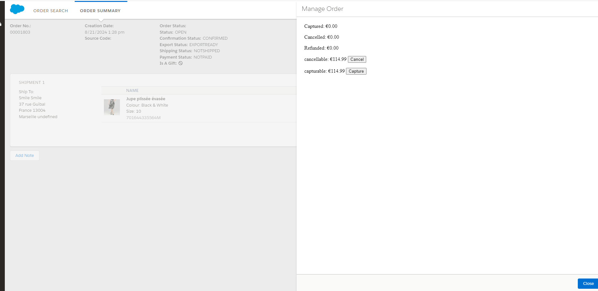

## Additional order handling

The actual business cases for processing an order vary greatly with each project. Some basis is created to facilitate simple order flows and payments - explained below. It should be noted that it is expected that in most cases order handling and/or transaction operations will not be handled entirely in SFCC, but in specialised order management/fulfillment platforms. 

A custom job step `custom.monextHandleOrders` is implemented. It accepts two parameters - query for the orders and array of allowed actions.

It can be used to automate certain processes depending on the business cases. It can be set to run on schedule or manually.

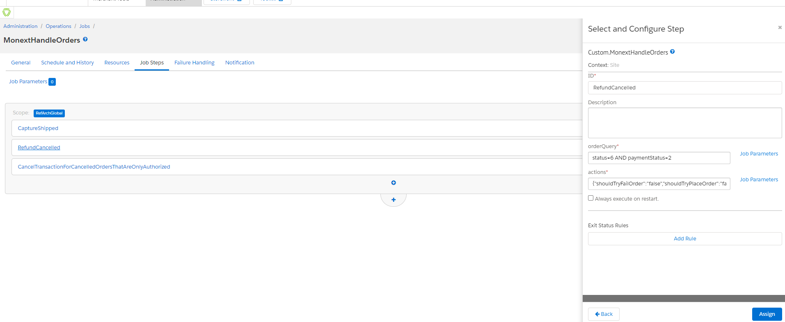

**Example 1**: Capture amount for shipped orders. 
In that case the query for orders could be:

```
(status=3 OR status=4) AND shippingStatus=2 AND paymentStatus=0
```

NEW/OPEN orders, that are shipped and not paid.

Actions object, should allow only capture:

```
{"shouldTryFailOrder":"false","shouldTryPlaceOrder":"false","shouldTryRefundPayment":"false","shouldTryCapturePayment":"true","shouldTryCancelPayment":"false","shouldTryCancelOrder":"false","shouldSetOrderAsPaid":"false"}
```

**Example 2**: Refund a certain amount for cancelled orders. 
In that case the query for orders could be:

```
status=6 AND paymentStatus=2
```
Cancelled orders, that are paid.

Actions object, should allow only refund:

```
 {"shouldTryFailOrder":"false","shouldTryPlaceOrder":"false","shouldTryRefundPayment":"true","shouldTryCapturePayment":"false","shouldTryCancelPayment":"false","shouldTryCancelOrder":"false","shouldSetOrderAsPaid":"false"}
```

**Example 3**: Cancel transactions that are only authorized but the order is cancelled before capture.
In that case the query for orders could be:

```
status=6 AND paymentStatus=0 AND custom.monextIsAuthorizedOnlyTransactionCancelled!=true
```

Cancelled orders, that are paid.

Actions object, should allow only refund:

```
 {"shouldTryFailOrder":"false","shouldTryPlaceOrder":"false","shouldTryRefundPayment":"false","shouldTryCapturePayment":"false","shouldTryCancelPayment":"true","shouldTryCancelOrder":"false","shouldSetOrderAsPaid":"false"}
```

The conditions for each action are added in the code of the cartridge in `int_monext\cartridge\scripts\monext\monextFlowRules.js`. You can override this file with different rules for each action.

# Prerequisites

1. Having your Monext API key ready. You can copy it (incl. 'Basic ') from the Monext backoffice and put it as password in the `monext` service credentials.

2. Having your Monext "Point Of Sales" identifier.

# Configuration

### New Site preference attributes

This cartridge add the following "Site preferences" attributes:

- Point of sale.
- Capture method.
- API key.
- Environment.

### New custom attributes of order level

To store the Monext session ID:

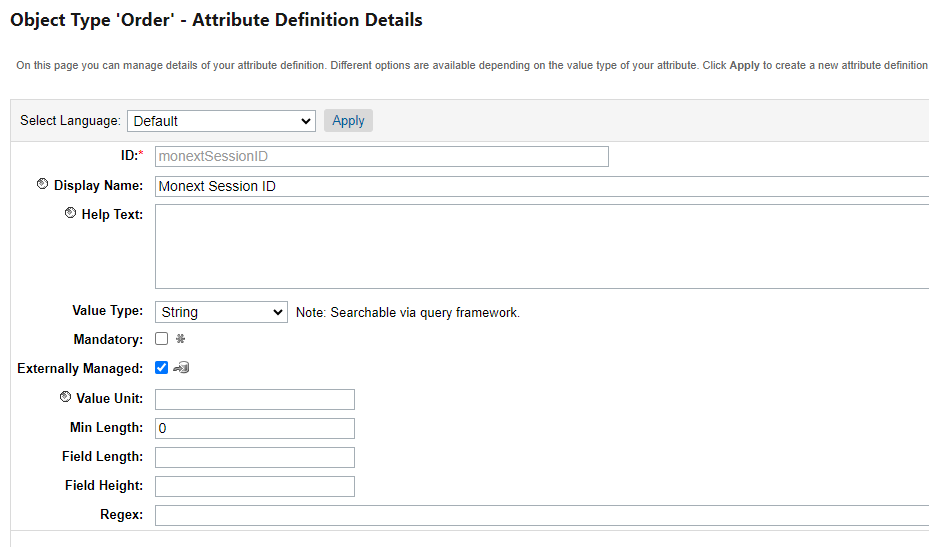

To determine if transactions were already cancelled before capture, because the built-in statuses are not sufficient.


### New payment method and payment processor
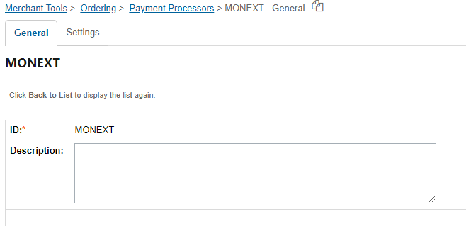

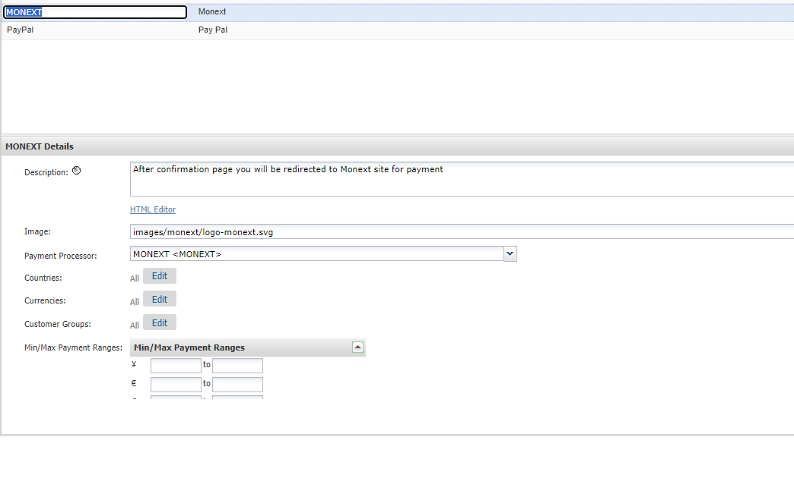

### New service configuration

- name: monext

No credentials are in the service configuration. Everything is set in site preferences.

# Installation

## Import folders

### Instance imports

Import instance template from folder `instance_template` to

   1. Add service,

        or create a service profile, credentials and service. Service has to be `monext`.

   2. Add custom attribute of type string `monextSessionID` to Order system object,

        or crete the attribute, check the meta file for exact configuration.

   3. Add attributes and group for sitePreferences object:

      1. `monext_pointOfSaleReference`
      2. `monext_capture`
      3. `monext_ApiKey`
      4. `monext_environment`

        Or create the attributes from the list, check the meta file for exact configuration.

### Site imports

In the folder `site_template`, rename the subfolder in sites named `RefArchGlobal` to match the site name and import the site template to (Repeat for each separate site):

   1. Add payment processor and method with name `MONEXT`,

        or create them for the site.

## Preferences settings

Configure the preferences:

1. `monext_pointOfSaleReference` (refer to [Prerequisites](#prerequisites))
2. `monext_capture` - Must be one of AUTOMATIC / MANUAL.
3. `monext_ApiKey` - API key as copied from Monext.
      Basic auth string containing user (matches Merchant ID) and password, joined with `:` and base64 encoded can be coped directly from the API key (refer to [Prerequisites](#prerequisites)).
4. `monext_environment` - Production or Test.
   
## Cartridge int_monext

1. Copy `int_monext` cartridge to current project.
2. Add `int_monext` to the start of the cartridge path for the site.

## Cartridge int_monext_overrides - can be added to path or used as reference for the required changes

1. (if used) Copy `int_monext_overrides` cartridge to current project.
2. (if used) Add `int_monext_overrides` to the start of the cartridge path for the site.
3. Update or override `cartridges\app_storefront_base\cartridge\templates\default\checkout\billing\paymentOptions\paymentOptionsContent.isml`:

    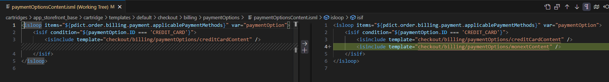

4. Update or override `cartridges\app_storefront_base\cartridge\templates\default\checkout\billing\paymentOptions\paymentOptionsTabs.isml`:

    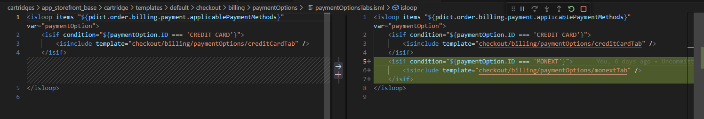

5. Update or override `cartridges\app_storefront_base\cartridge\templates\default\checkout\billing\paymentOptions\paymentOptionsSummary.isml`:

    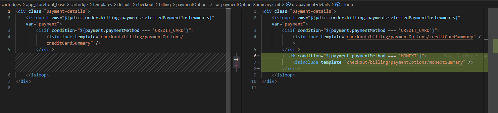

6. Override `cartridges\app_storefront_base\cartridge\controllers\CheckoutServices.js` to allow interruption of order placement flow until HPP calls back. A new endpoint will handle the callback :

      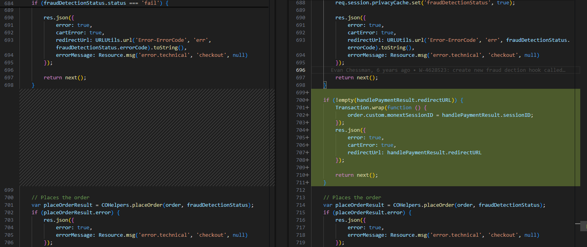

7. Update or override `cartridges\app_storefront_base\cartridge\models\payment.js`:

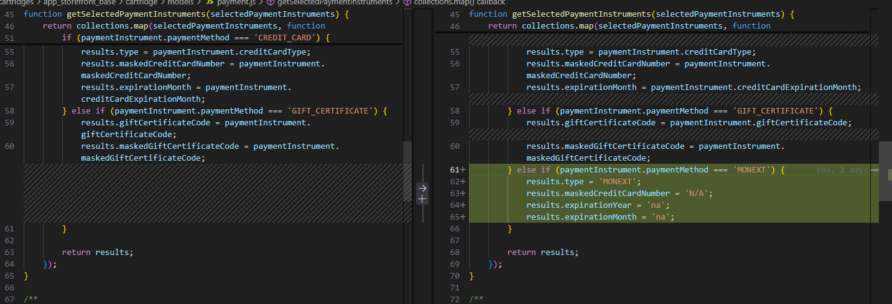

8. File `cartridges\int_monext\cartridge\scripts\checkout\checkoutHelpers.js` was overridden to allow HPP URL to be communicated to the confirmation flow:

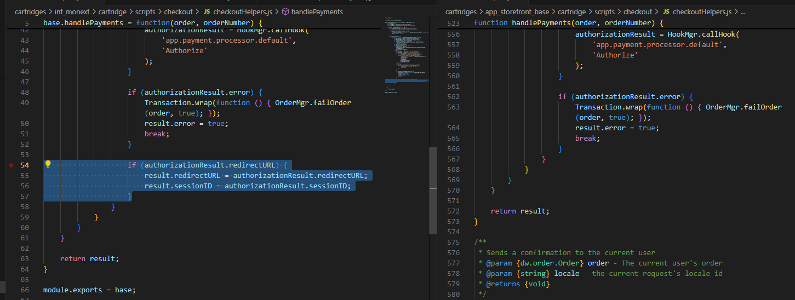

## Cartridge bm_monext

1. Upload `bm_monext` on instance.
2. Add `bm_monet` and `int_monext` to business manager cartridge path.

# Additional resources for developers

- [Monext API documentation](https://api-docs.retail.monext.com/reference/getting-started-with-your-api)
- [Monext documentation](https://docs.monext.fr/display/DT/Plugin+Salesforce)
- [SFCC](https://developer.salesforce.com/developer-centers/commerce-cloud)

# License

This cartridge's source code is completely free and released under the terms of the MIT license.

# Contact and support

If you want to contact us, the best way is through [this page on our website](https://www.monext.fr/gardons-le-contact) and send us your question(s).

We guarantee that we answer as soon as we can!

If you need support you can also directly check our FAQ section and contact us [on the support page](https://support.payline.com/hc/fr).
